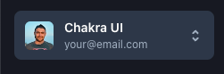

# Linx Security - Frontend Home Exercise

## Overview
Hi there!

We hope that the process is going well for you so far.

The task is designed to test your frontend experience, problem-solving skills and attention to detail. 

## Instructions
- The code consists of a minimal project using Next.js and chakra-ui
- Clone the code to your local development environment
- Run `yarn install` to install the dependencies and `yarn run dev` to start the dev server
- You are allowed to use any documentation online
- Complete as many steps as you can in the given timeframe
- Refer to [this Figma](https://www.figma.com/file/d9c7lPbEoFoyKlgqHUTdrz/FE-Assignment?type=design&node-id=0%3A1&mode=design&t=wNFQaDiLoPAMV6mP-1) when implementing steps 1-2 

## Steps
1. Add a new page called "Library" under the authenticated section, and add it to the sidebar (under INTEGRATIONS).
2. Add a grid to the page, and include cards with an “integration” icon in the middle.
3. Navigate to `/login`. Notice that after the user inputs their email and hits `Continue with email` nothing happens. Your goal is that after submitting the email, we will redirect to `/` and present the email at the account switcher:

    

## Submission

Upload your solution using [this form](https://forms.gle/NBcXLi38HMSdMYVC8)
